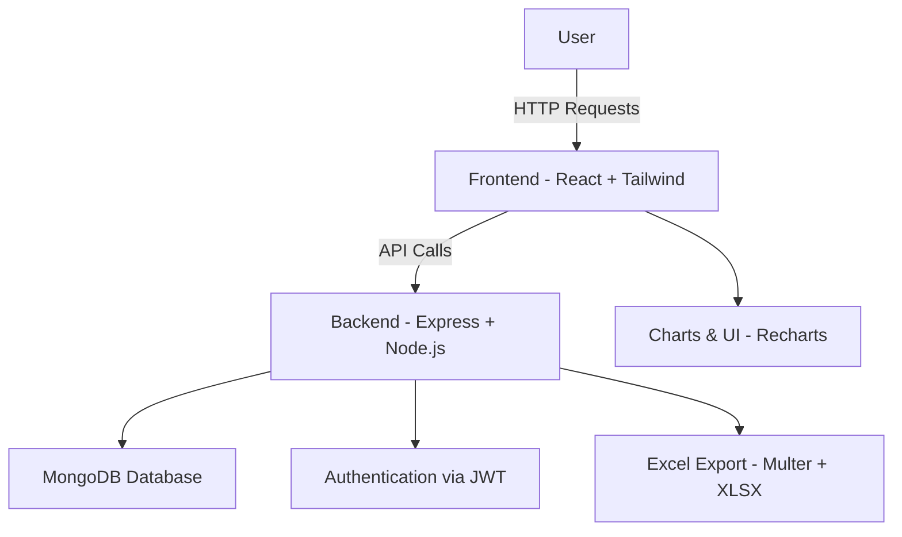

# 💰 Expense Tracker Web App

A full-stack **MERN (MongoDB, Express, React, Node.js)** based Expense Tracker that helps users manage income, expenses, and budgets with an intuitive dashboard.  
Built with ❤️ by **[@jcobsntos](https://github.com/jcobsntos)**


---

## 🎥 Demo Preview (GIF)

> Add a screen recording of your app in action here (e.g., `demo.gif` in the repo).


---

## 🛠 Tech Stack

| Technology                | Purpose                              |
| ------------------------- | ------------------------------------ |
| **React.js**              | Frontend UI library                  |
| **Tailwind CSS**          | Styling and responsive design        |
| **Node.js**               | Runtime environment                  |
| **Express.js**            | Backend framework                    |
| **MongoDB**               | Database                             |
| **Mongoose**              | ODM for MongoDB                      |
| **JWT (JSON Web Tokens)** | Authentication & Authorization       |
| **Recharts**              | Data visualization (graphs & charts) |
| **Axios**                 | API communication                    |

---

## 🚀 Features

- 🔐 **User Authentication** – Secure login & sign-up with JWT
- 📊 **Dashboard Overview** – Total balance, income & expense summary
- 💵 **Income Management** – Add, view, delete, and export income sources
- 💸 **Expense Management** – Track expenses by category, delete, and export
- 📈 **Interactive Charts** – Bar, Pie, and Line charts for financial insights
- 🕒 **Recent Transactions** – Quick access to the latest records
- 📑 **Excel Reports** – Export all income & expense data
- 📱 **Responsive Design** – Works across desktop, tablet, and mobile
- 🧭 **Intuitive Navigation** – Sidebar access to Dashboard, Income, Expenses, and Logout
- ❌ **Delete with Ease** – Hover over items to reveal a delete button

---

## 📂 Folder Structure

```
expense-tracker-web-app/
│
├── backend/                # Express server & API routes
│   ├── models/             # Mongoose models
│   ├── routes/             # Express routes
│   └── controllers/        # Controller logic
│
├── frontend/expense-tracker/
│   ├── src/
│   │   ├── components/     # React components
│   │   ├── pages/          # React pages
│   │   ├── hooks/          # Custom React hooks
│   │   └── utils/          # Helper functions & configs
│
├── .gitignore
├── LICENSE
└── README.md
```

---

## 📸 Screenshots

Here are some previews of the app in action:

| Login Page                 | Sign Up Page                     | Dashboard                          |
| -------------------------- | -------------------------------- | ---------------------------------- |
|  |  |  |

| Income Page                  | Expense Page                    |
| ---------------------------- | ------------------------------- |
|  |  |


---

## 🔄 System Architecture (Mermaid Diagram)



---

## 🚀 Getting Started

### 1️⃣ Clone the Repository

```bash
git clone https://github.com/jcobsntos/expense-tracker-web-app.git
cd expense-tracker-web-app
```

### 2️⃣ Node version

Make sure you’re using the correct Node version:

```bash
nvm use node
```

### 3️⃣ Install Dependencies

For backend:

```bash
cd backend
npm install express jsonwebtoken mongoose dotenv cors bcryptjs multer xlsx

```

### 🔑 Generate JWT Secret

```bash
node -e "console.log(require('crypto').randomBytes(64).toString('hex'))"
```

Create .env file inside backend/

```bash
MONGO_URI=mongodb+srv://{username}:<db_password>@expensetracker.mongodb.net/?retryWrites=true&w=majority&appName={clusterName}
JWT_SECRET={generatedToken}
PORT=8000
```

### MongoDB Setup

1. Create/sign in to a MongoDB Atlas account

2. Create a cluster and get the connection string

3. Replace <db_password> in your .env file

### 4️⃣ For frontend

```bash
cd frontend/expense-tracker
npm install
```

### 5️⃣ Run the App

Go back to root folder

```bash
npm run dev
```

---

## 🤝 Contributing

Contributions are welcome!

1. Fork the project
2. Create your feature branch (`git checkout -b feature/AmazingFeature`)
3. Commit your changes (`git commit -m 'Add some AmazingFeature'`)
4. Push to the branch (`git push origin feature/AmazingFeature`)
5. Open a Pull Request

---

## 🛣 Roadmap

- [ ] Add recurring expenses feature
- [ ] Implement dark mode
- [ ] Mobile responsive improvements
- [ ] Multi-user support with role management
- [ ] Export reports as PDF/CSV

---

## 📜 License

This project is licensed under the **MIT License** - see the [LICENSE](LICENSE) file for details.

---

## 🙏 Acknowledgements

- [React Documentation](https://react.dev/)
- [Node.js Docs](https://nodejs.org/en/docs/)
- [MongoDB Docs](https://www.mongodb.com/docs/)
- [Tailwind CSS](https://tailwindcss.com/)
- [Recharts](https://recharts.org/en-US/)

---

Built with ❤️ by [@jcobsntos](https://github.com/jcobsntos)
