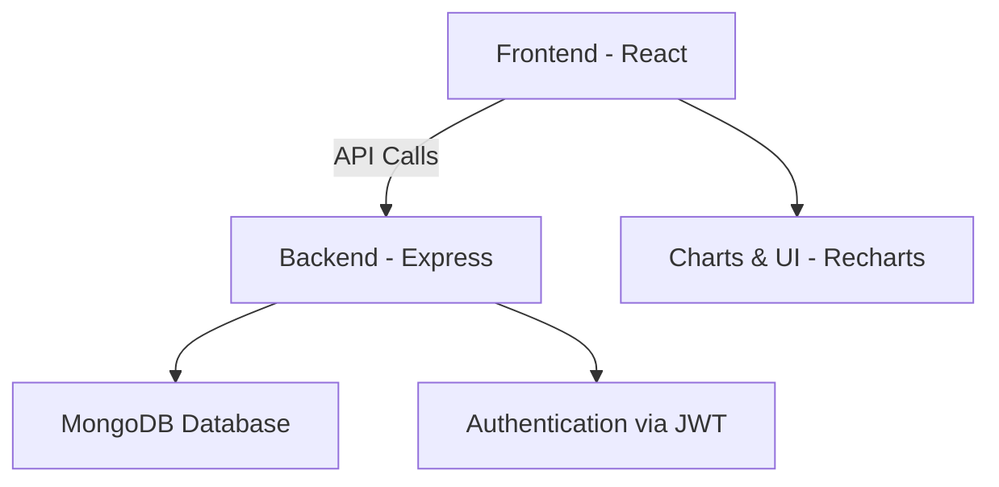

# 💰 Expense Tracker Web App

A full-stack **MERN (MongoDB, Express, React, Node.js)** based Expense Tracker that helps users manage income, expenses, and budgets with an intuitive dashboard.  
Built with ❤️ by **[@jcobsntos](https://github.com/jcobsntos)**


---

## 🎥 Demo Preview (GIF)
> Add a screen recording of your app in action here (e.g., `demo.gif` in the repo).


---

## 🛠 Tech Stack

| Technology | Purpose |
|------------|---------|
| **React.js** | Frontend UI library |
| **Tailwind CSS** | Styling and responsive design |
| **Node.js** | Runtime environment |
| **Express.js** | Backend framework |
| **MongoDB** | Database |
| **Mongoose** | ODM for MongoDB |
| **JWT (JSON Web Tokens)** | Authentication & Authorization |
| **Recharts** | Data visualization (graphs & charts) |
| **Axios** | API communication |

---

## 📂 Folder Structure

```
expense-tracker-web-app/
│
├── backend/                # Express server & API routes
│   ├── models/             # Mongoose models
│   ├── routes/             # Express routes
│   └── controllers/        # Controller logic
│
├── frontend/expense-tracker/
│   ├── src/
│   │   ├── components/     # React components
│   │   ├── pages/          # React pages
│   │   ├── hooks/          # Custom React hooks
│   │   └── utils/          # Helper functions & configs
│
├── .gitignore
├── LICENSE
└── README.md
```

---

## 📸 Screenshots

Add your app’s screenshots here (e.g., dashboard, login, charts).


---

## 🔄 System Architecture (Mermaid Diagram)



---

## 🚀 Getting Started

### 1️⃣ Clone the Repository
```bash
git clone https://github.com/jcobsntos/expense-tracker-web-app.git
cd expense-tracker-web-app
```

### 2️⃣ Install Dependencies
For backend:
```bash
cd backend
npm install
```

For frontend:
```bash
cd frontend/expense-tracker
npm install
```

### 3️⃣ Run the App
Backend:
```bash
npm run dev
```

Frontend:
```bash
npm run dev
```

---

## 🤝 Contributing

Contributions are welcome!  
1. Fork the project  
2. Create your feature branch (`git checkout -b feature/AmazingFeature`)  
3. Commit your changes (`git commit -m 'Add some AmazingFeature'`)  
4. Push to the branch (`git push origin feature/AmazingFeature`)  
5. Open a Pull Request  

---

## 🛣 Roadmap

- [ ] Add recurring expenses feature  
- [ ] Implement dark mode  
- [ ] Mobile responsive improvements  
- [ ] Multi-user support with role management  
- [ ] Export reports as PDF/CSV  

---

## 📜 License

This project is licensed under the **MIT License** - see the [LICENSE](LICENSE) file for details.

---

## 🙏 Acknowledgements

- [React Documentation](https://react.dev/)  
- [Node.js Docs](https://nodejs.org/en/docs/)  
- [MongoDB Docs](https://www.mongodb.com/docs/)  
- [Tailwind CSS](https://tailwindcss.com/)  
- [Recharts](https://recharts.org/en-US/)  

---

Built with ❤️ by [@jcobsntos](https://github.com/jcobsntos)
